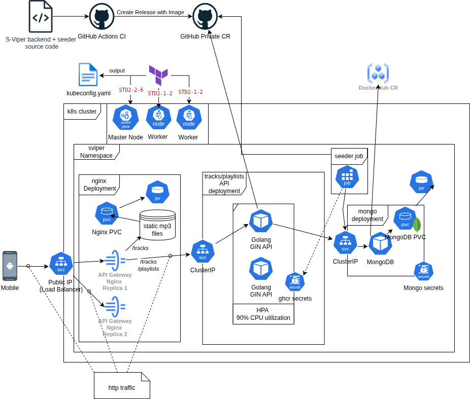

## Welcome to the **S-VIPER** 🐍

S-viper – это **сервис для подбора и организации плейлистов и сетов с интерактивным интерфейсом свайпов**


## 🔥 Full-Stack Project Overview

Этот репозиторий служит точкой входа для всех компонентов проекта. Ниже перечислены основные модули, участвующие в разработке.

### 🧰 Технологии
- **Backend:** Go (Gin, REST API, gRPC), MongoDB
- **Infrastructure:** Docker, Docker Compose, Kubernetes, Terraform, Nginx, CI/CD (GitHub Actions)
- **Cloud & DevOps:** VK Cloud (IaaS), GitHub Container Registry, Git submodules, многорепозитной структуры, управление артефактами и окружениями, GitHub Relesase
- **Mobile:** Kotlin, Jetpack Compose
- **Project Management:** проектирование архитектуры сервисов и инфраструктуры, настройка окружений, документация и организация GitHub Projects/Issues  


## Репозитории и их назначения

### 🔹**compose-env**  
  1. Docker Compose окружение для быстрого развёртывания всех сервисов локально.
  1. Terraform конфиги для деплоя backend части сервиса на одной VM.
  1. k8s и terrafrom конфиги для деплоя backend части сервиса на кластере.

  Включает backend, mongo-db, nginx-api-gateway через `git submodules`

### 🔹**backend**  
  1. Основная серверная часть проекта. Реализует бизнес-логику, REST API и взаимодействие с базой данных.
  1. Включает небольшой скрипт на go для заполнения БД.
  
  **Артефакты CI**: backend image, seeder image.

### 🔹 **mobile**  
  Мобильное Android приложение клиента. Предоставляет интерфейс для пользователей и взаимодействует с backend через API.

### 🔹**mongo-db**  
  Конфигурация MongoDB.

### 🔹**nginx-api-gateway**  
  Reverse-proxy и шлюз для всех API. Обеспечивает маршрутизацию, а также статическое хранилище для mp3 файлов.


## 🖧 Описание инфраструктуры проекта S-VIPER, архитектурную схему и список k8s-ресурсов.
  
  
  
  Компоненты инфраструктуры:
  * **Mobile**: Android-приложение (клиент)
  * **API Gateway**: Nginx (раздача треков по пути `/tracks/{id}` + перенаправление на API)
  * **Tracks/Playlists API**: сервис на Go + Gin (обслуживание API для метаданных и управления)
  * **MongoDB**: БД для метаданных
  * **Seeder job**: сервис для заполнения БД метаданными треков
  
    
  ### <svg width="19px" xmlns="http://www.w3.org/2000/svg" viewBox="0 0 128 128"><g fill="#486bb3"><path d="M56.484 55.098c.37.27.82.43 1.31.43 1.2 0 2.18-.95 2.23-2.13l.05-.03.75-13.26c-.9.11-1.8.26-2.7.46-4.93 1.12-9.2 3.55-12.54 6.83l10.87 7.71.03-.01zM55.034 74.528a2.218 2.218 0 00-2.58-1.69l-.02-.03-13.05 2.21a26.15 26.15 0 0010.51 13.15l5.06-12.22-.04-.05c.17-.42.23-.89.12-1.37zM50.694 65.118c.44-.12.85-.38 1.16-.76.75-.94.62-2.29-.28-3.07l.01-.05-9.93-8.88a26.07 26.07 0 00-3.7 16.48l12.73-3.67.01-.05zM60.334 69.018l3.66 1.76 3.66-1.75.9-3.95-2.53-3.16h-4.06l-2.54 3.16zM67.934 53.348c.02.46.18.91.49 1.29.75.94 2.1 1.11 3.06.41l.04.02 10.8-7.66c-4.08-3.99-9.4-6.6-15.15-7.3l.75 13.24h.01zM75.514 72.778c-.17-.03-.34-.05-.51-.04-.29.01-.58.09-.85.22a2.23 2.23 0 00-1.08 2.89l-.02.02 5.11 12.34c4.93-3.14 8.61-7.83 10.54-13.24l-13.16-2.23-.03.04zM65.954 79.318a2.246 2.246 0 00-2.04-1.17c-.77.03-1.5.46-1.89 1.18h-.01l-6.42 11.6a26.16 26.16 0 0014.27.73c.88-.2 1.74-.44 2.57-.72l-6.43-11.63h-.05z"/><path d="M124.544 76.788l-10.44-45.33a8.012 8.012 0 00-4.37-5.43l-42.24-20.18a8.157 8.157 0 00-3.92-.78 8.15 8.15 0 00-3.1.78l-42.24 20.18a8.055 8.055 0 00-4.37 5.43l-10.41 45.34a7.92 7.92 0 001.1 6.14c.14.22.3.43.46.64l29.24 36.35a8.087 8.087 0 006.32 3.01l46.89-.01c2.46 0 4.78-1.11 6.32-3.01l29.23-36.36a7.981 7.981 0 001.53-6.77zm-16.07-.55c-.31 1.35-1.76 2.17-3.26 1.85-.01 0-.03 0-.04-.01-.02 0-.03-.01-.05-.02-.21-.05-.47-.09-.65-.14-.86-.23-1.49-.58-2.27-.88-1.67-.6-3.06-1.1-4.41-1.3-.69-.05-1.04.27-1.42.52-.18-.04-.75-.14-1.08-.19-2.42 7.61-7.58 14.21-14.57 18.33.12.29.33.91.42 1.02-.16.43-.4.83-.19 1.49.49 1.27 1.28 2.52 2.24 4.01.46.69.94 1.22 1.36 2.02.1.19.23.48.33.68.65 1.39.17 2.99-1.08 3.59-1.26.61-2.82-.03-3.5-1.43-.1-.2-.23-.46-.31-.65-.36-.82-.48-1.52-.73-2.32-.57-1.68-1.05-3.07-1.73-4.25-.39-.57-.86-.64-1.29-.78-.08-.14-.38-.69-.54-.97-1.4.53-2.84.97-4.34 1.31-6.56 1.49-13.13.89-18.99-1.37l-.57 1.04c-.43.11-.84.23-1.09.53-.92 1.1-1.29 2.86-1.96 4.54-.25.79-.37 1.5-.73 2.32-.08.19-.22.45-.31.64v.01l-.01.01c-.67 1.39-2.23 2.03-3.49 1.43-1.25-.6-1.72-2.2-1.08-3.59.1-.2.22-.49.32-.68.42-.79.89-1.33 1.36-2.02.96-1.5 1.8-2.84 2.29-4.11.12-.42-.06-1-.22-1.43l.46-1.1c-6.73-3.99-12.04-10.34-14.58-18.21l-1.1.19c-.3-.17-.89-.56-1.45-.51-1.35.2-2.74.7-4.41 1.3-.78.3-1.4.64-2.27.87-.18.05-.44.1-.65.15-.02 0-.03.01-.05.02-.01 0-.03 0-.04.01-1.5.32-2.95-.5-3.26-1.85-.31-1.35.65-2.72 2.14-3.08.01 0 .03-.01.04-.01.01 0 .01 0 .02-.01.21-.05.48-.12.68-.16.88-.17 1.6-.13 2.43-.19 1.77-.19 3.23-.34 4.53-.75.41-.17.81-.74 1.09-1.1l1.06-.31c-1.19-8.22.82-16.28 5.16-22.81l-.81-.72c-.05-.32-.12-1.04-.51-1.46-.99-.93-2.25-1.71-3.76-2.64-.72-.42-1.38-.69-2.1-1.23-.15-.11-.36-.29-.52-.42-.01-.01-.03-.02-.04-.03-1.21-.97-1.49-2.64-.62-3.73.49-.61 1.24-.92 2.01-.89.6.02 1.23.24 1.76.66.17.14.41.32.56.45.68.58 1.09 1.16 1.66 1.77 1.25 1.27 2.28 2.32 3.41 3.08.59.35 1.05.21 1.5.15.15.11.63.46.91.65 4.3-4.57 9.96-7.95 16.52-9.44 1.53-.35 3.05-.58 4.57-.7l.06-1.07c.34-.33.71-.79.82-1.31.11-1.36-.07-2.82-.28-4.59-.12-.82-.31-1.51-.35-2.4-.01-.18 0-.44.01-.65 0-.02-.01-.05-.01-.07 0-1.55 1.13-2.81 2.53-2.81s2.53 1.26 2.53 2.81c0 .22.01.52.01.72-.03.89-.23 1.58-.35 2.4-.21 1.76-.4 3.23-.29 4.59.1.68.5.95.83 1.26.01.18.04.79.06 1.13 8.04.71 15.5 4.39 20.99 10.14l.96-.69c.33.02 1.04.12 1.53-.17 1.13-.76 2.16-1.82 3.41-3.08.57-.61.99-1.18 1.67-1.77.15-.13.39-.31.56-.45 1.21-.97 2.9-.86 3.77.23s.59 2.76-.62 3.73c-.17.14-.39.33-.56.45-.72.53-1.38.8-2.1 1.23-1.51.93-2.77 1.71-3.76 2.64-.47.5-.43.98-.48 1.43-.14.13-.63.57-.9.8a32.75 32.75 0 014.74 10.95c.92 3.99 1.06 7.97.53 11.8l1.02.3c.18.26.56.89 1.09 1.1 1.3.41 2.76.56 4.53.75.83.07 1.55.03 2.43.19.21.04.52.12.73.17 1.5.37 2.45 1.74 2.14 3.09z"/><path d="M86.274 52.358l-9.88 8.84.01.03c-.34.3-.6.7-.71 1.18-.27 1.17.44 2.33 1.58 2.65l.01.05 12.79 3.68c.27-2.76.11-5.62-.55-8.48-.66-2.89-1.77-5.56-3.25-7.95z"/></g></svg> Kubernetes — ресурсы
  ☁️ Сам кластер разворачивается через `Terraform` в VK Cloud. Конфиги в репозитории `compose-env`/k8s/terraform.
  
  Кластер состоит из 2 worker node на VM `STD2-1-2` и ControlPlane на VM `STD2-2-6`. 
  
  В результате применения конфигурационных файлов появится `kubeconfig.yaml`, который нужен для взаимодействия с кластером через `kubectl`.
  
  **Имеющиеся ресурсы:**
  * Глобальный namespace для приложения
  * Service ClusterIP: Music API, MongoDB
  * Service LoadBalancer: API Gateway
  * Deployments: Nginx (как Gateway), backend, mongoDB
  * PVC: MongoDB, Nginx
  * PersistentVolume: локальное хранилище на нодах.
  * Secrets: GitHub Container Registry, MongoDB credentials
  * Job: Seeder для заполнения MongoDB
  
  Backend, seeder images подтягиваются из приватного CR, остальные из DockerHub.
  
  ---
  
  *Деплой приложений и подробные инструкции по CI/CD и командам находятся в соответствующих репозиториях сервисов.*


#### Документация

- **Drawio диаграммы**  
  [Инфраструктура будущего решения, MVP инфраструктура и схема БД](https://github.com/S-VIPER/.github/tree/main/drawio-architecture)
 
  
- **SQL и NoSQL схемы**  
  [Схема NoSQL БД (MongoDB) и SQL(пока не используется)](https://github.com/S-VIPER/.github/blob/main/database_schema.md)


## 🚀 Быстрый старт

1. Клонируйте репозиторий и перейдите в `compose-env`
2. Запустите все сервисы:
   ```bash
   docker-compose up --build
3. Клонируйте репозиторий mobile
4. Соберите apk
